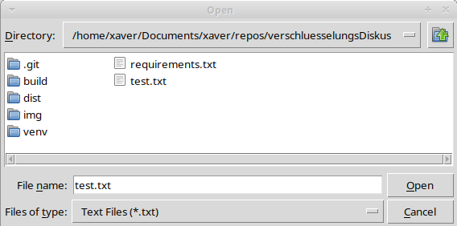

# Schwarzmaraskanischer Diskus Verschluesserer

This program implements a text encryption and decryption system based on a balanced binary tree structure (red/black).
The encryption paths for each character are determined based on the tree structure (which is printed on creation), and the resulting encrypted text is visualized as SVG and PNG images.

Take a look at Asboran who had the idea https://asboran.de/2015/10/16/spielhilfe-schwarzmaraskanischer-verschluesselungs-diskus/ and created a [pdf](https://asboran.de/wp-content/uploads/2017/11/Schwarzmaraskanischer-Verschl%C3%BCsselungsdiskus.pdf) describing how it works.

## Running The Script

To use the program, make sure you have Python 3 and the requirements installed (see requirements.txt). For installing the requirements I recommend setting up a [virtual environment](https://docs.python.org/3/library/venv.html).

## EXE - Linux Only

If you are using Linux you can use the provided exe in the `dist` folder. I need to compile the program for other operating systems on those operating systems. I could do windows. Please get in touch if you are interested.

## How does it look like?
### GUI
First you need to create an encryption which is automatically loaded:

You can take a look at the tree (the image file is automatically generated). You can use that view to draw a nicer looking diskus for your group. Take a look at the [asboran version](https://asboran.de/wp-content/uploads/2015/10/Huffman-Scheibe-Haffax.png) to get an idea.

Now you can click Select Text File To Encrypt and select a txt file:

The encrypted result is saved as an svg and png. Each word will be in a new line:

Now you are ready to include that png in whatever your handouts. Just make sure to give the players a chance to find the diskus - otherwise it is quite hard to crack for humans.

## Future Readings

If you are interested in the technical side of this topic, you might be interested in [Huffman Coding](https://en.wikipedia.org/wiki/Huffman_coding).